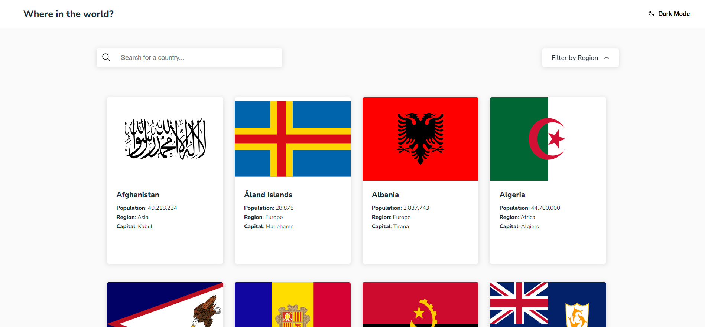

# Frontend Mentor - REST Countries API with color theme switcher solution

This is a solution to the [REST Countries API with color theme switcher challenge on Frontend Mentor](https://www.frontendmentor.io/challenges/rest-countries-api-with-color-theme-switcher-5cacc469fec04111f7b848ca). Frontend Mentor challenges help you improve your coding skills by building realistic projects. 

## Table of contents

- [Overview](#overview)
  - [Screenshot](#screenshot)
  - [The challenge](#the-challenge)
  - [Links](#links)
- [My process](#my-process)
  - [Built with](#built-with)
  - [What I learned](#what-i-learned)
- [Author](#author)

## Overview
### Screenshot

### The challenge

Users should be able to:

- See all countries from the API on the homepage
- Search for a country using an `input` field
- Filter countries by region
- Click on a country to see more detailed information on a separate page
- Toggle the color scheme between light and dark mode

### Links
- Solution URL: [Add solution URL here](https://your-solution-url.com)
- Live Site URL: [live](https://check-your-country.netlify.app/)

## My process

### Built with

- Semantic HTML5 markup
- CSS custom properties
- Flexbox
- CSS Grid
- Mobile-first workflow
- Javascript ES6
- Rest API

### What I learned

This is my first project in which I have used an API to fetch data. I learned a lot from this project and this project forced me to learn more things to complete this project. I learn about how to redirect from page to page and how to update page content dynamically.

## Author

- LinkedIn - [@gitanshu-sankhla](https://www.linkedin.com/in/gitanshu-sankhla/)
- Frontend Mentor - [@gitanshu18](https://www.frontendmentor.io/profile/gitanshu18)
- Github - [@Gitax18](https://github.com/Gitax18)
- Instagram - [@lazydeveloper18](https://www.instagram.com/lazydeveloper18/)